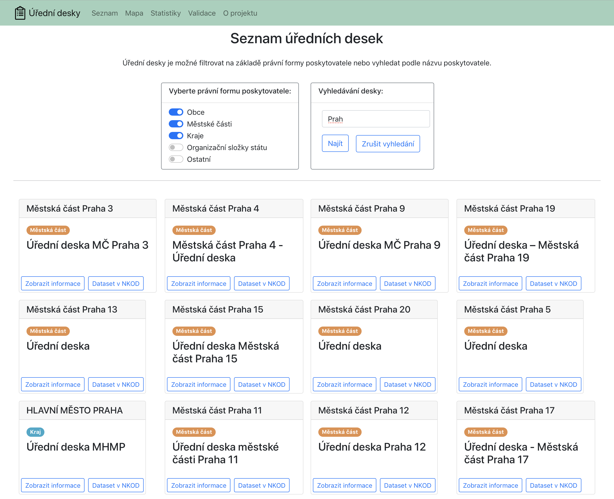
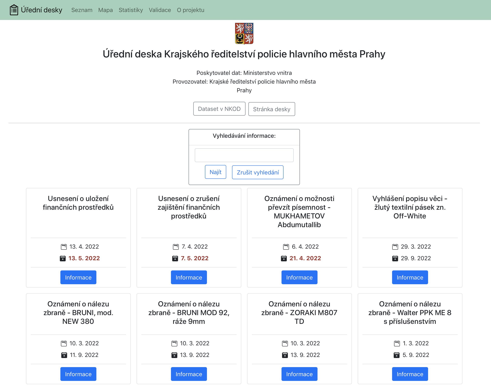
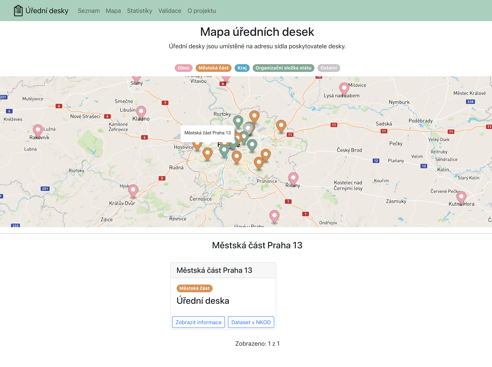
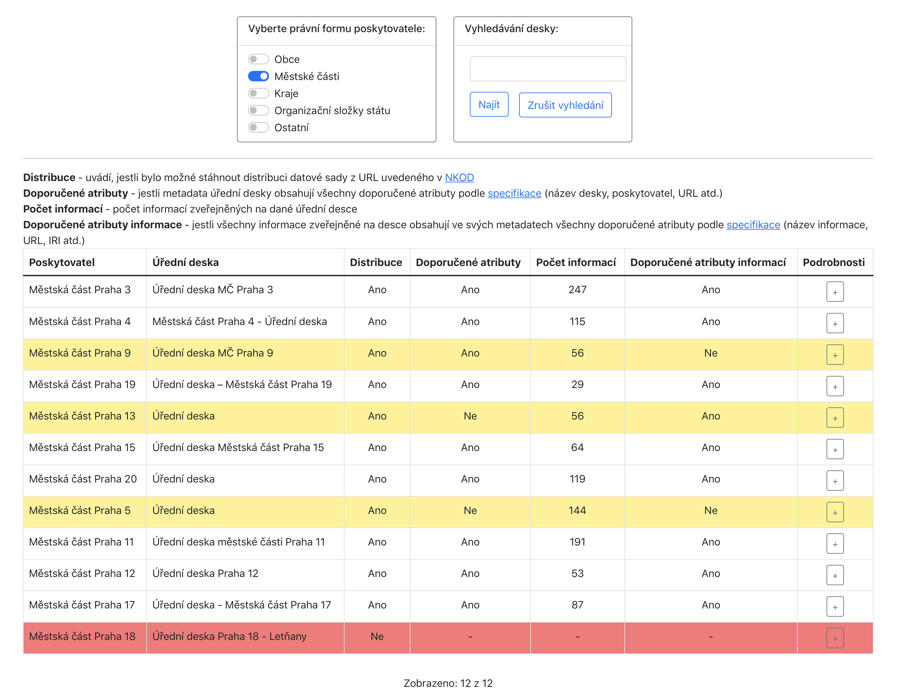
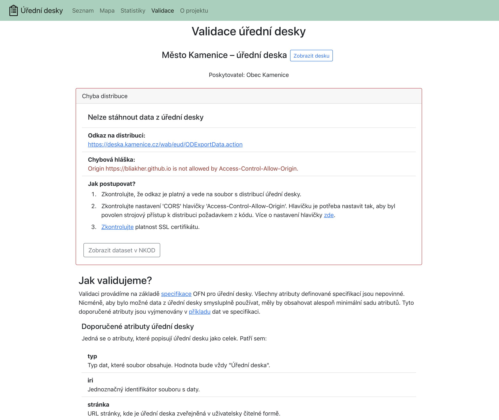
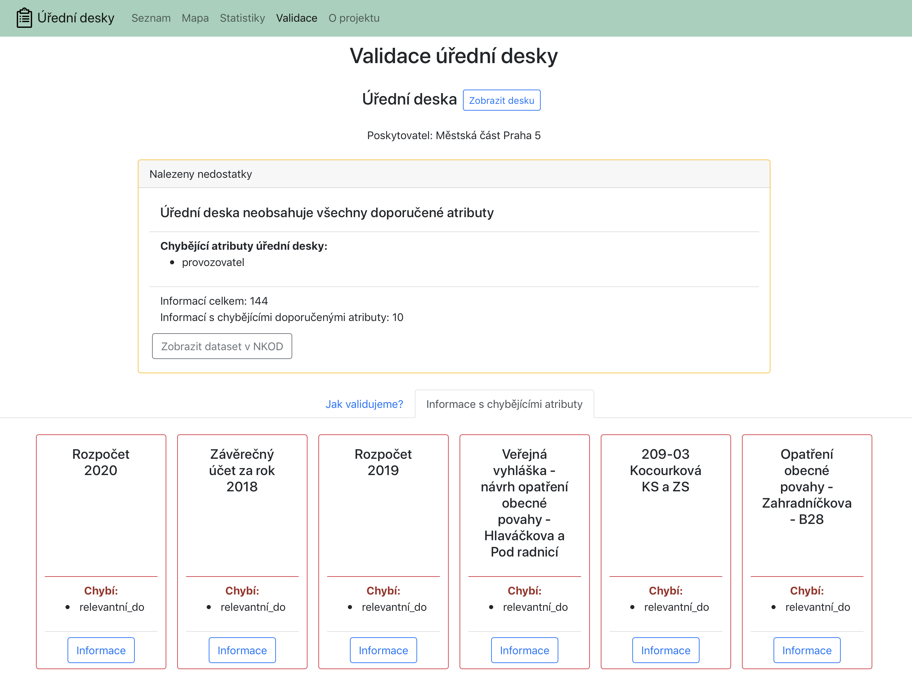
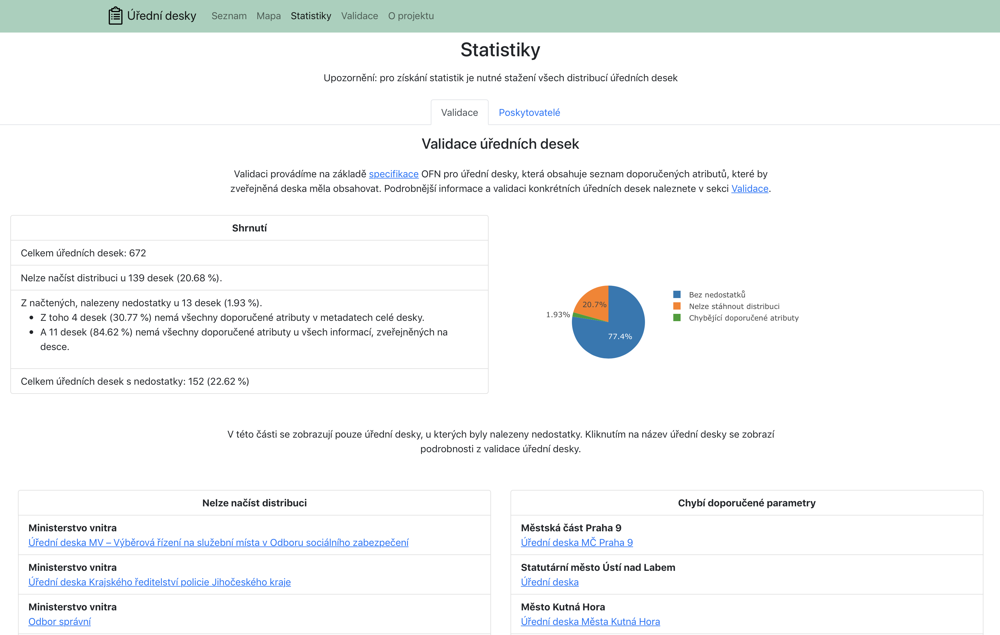
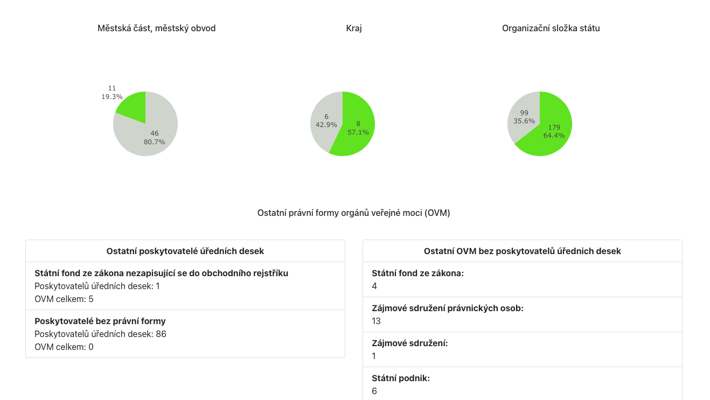

## Uživatelská dokumentace

V navigačním panelu aplikace najdeme odkazy do 4 částí aplikace:
- Seznam
- Mapa
- Statistiky
- Validace

#### Seznam

Tato část obsahuje seznam všech úředních desek, které má aplikace k dispozici.
Aplikace data z úředních desek získává z Národního katalogu otevřených dat (NKOD),
může tedy zobrazit pouze ty desky, které jsou daným úřadem zveřejněné v NKOD jako otevřená data.

Úřední desky je možné filtrovat podle právní formy poskytovatele. Právní formy, které podporujeme jsou:
- obce
- městské části a městské obvody
- kraje
- organizační složky státu

Právní formy poskytovatelů zjišťujeme z údajů uvedených v [Registru práv a povinností](https://www.szrcr.cz/cs/registr-prav-a-povinnosti). Poskytovatelé ostatních právních forem, nebo poskytovatelé, u kterých nelze zjistit formu jsou v kategorii ostatní.

Pro filtrování desek použijte panel `Vyberte právní formu poskytovatele`. Nechte vybrané pouze ty právní formy, jejichž poskytovatele chcete vyfiltrovat.

V úředních deskách je také možné vyhledávat na základě názvu desky nebo jména poskytovatele pomocí formuláře pro vyhledávání.

Příklad seznamu, kde jsou vyfiltrované pouze úřední desky týkající se Prahy od poskytovatelů s právními formami obec, městská část nebo kraj:

Ze seznamu je možné přejít na detail úřední desky zmáčknutím tlačítka `Zobrazit informace`. V detailu desky se zobrazují informace z dané úřední desky, ve kterých je možné vyhledávat podle názvu s použitím formuláře na vyhledávání. 

Níže vidíme příklad detailu úřední desky Krajského ředitelství policie hl. m. Prahy. Pokud deska již není relevantní, tedy datum relevance již uplynulo, je zvýrazněné červeně.

#### Mapa

V této části jsou úřední desky zobrazené na mapě ČR. Úřední desky jsou rozdělené podle poskytovatelů, kteří zveřejnili data v NKOD. Poskytovatel je na mapě označen bodem, který je zbarvený podle právní formy poskytovatele. Legenda k barvám je umístěná nad mapou.

Při kliknutí na bod na mapě se pod mapou zobrazí název daného poskytovatele a všechny jeho úřední desky. Ze seznamu desek je opět možné přejít do detailu desky.

Příklad zobrazení desky úřadu městské části Praha 13 z mapy:

#### Validace

Část validace je určená hlavně poskytovatelům dat. Provádí se zde validace dat, konkrétně se kontroluje, jestli je data možné stáhnout a jestli obsahují všechny doporučené parametry podle specifikace datového formátu, podle kterého se mají zveřejňovat, který je určený [Otevřenou formální normou pro úřední desky](https://ofn.gov.cz/úřední-desky/2021-07-20/).

Výsledky validace jsou znázorněné tabulkou. Každý řádek tabulky představuje shrnutí výsledků validace jedné úřední desky.
Řádek obsahuje název desky a jejího poskytovatele, informaci o tom, jestli je možné stáhnout distribuci s daty desky, jestli data obsahují všechny doporučené atributy a počet informací na desce.

Níže je příklad tabulky s výsledky validace, kde jsou vyfiltrované pouze úřední desky městských částí. Pro větší přehlednost jsou řádky s deskou, kde není  možné stáhnout distribuci, obarvené červeně, a řádky desek, kde chybí některé doporučené atributy, jsou obarvené žlutě.

Z tabulky je možné se prokliknout na detail validace. Je zde vysvětleno, jakým způsobem se validuje a jaký je význam jednotlivých doporučených atributů (v části `Jak validujeme?`).

Pokud distribuci desky není možné stáhnout, zobrazí se v detailu chybová hláška získaná při stahování a seznam nejčastějších příčin, které tento problém způsobují s odkazy na další informace o problému jako vidíme na další ukázce.

Pokud v distribuci desky chybí některé doporučené atributy, je zde vypsané, které to jsou. Pokud se jedná o doporučené atributy informací, zobrazí se v záložce  `Informace s chybějícími atributy` seznam všech informací s nedostatky, kde u každé informace je uvedeno, které atributy chybí.

Na následujícím příkladu validace desky úřadu městské části Praha 5 si můžeme všimnout, že v distribuci chybí doporučený atribut desky `provozovatel` a v 10 informacích na desce z celkem 144 chybí doporučený atribut `relevantní_do`. Můžeme si prohlédnout, o které informace se jedná.

#### Statistiky

V této části se zobrazují souhrnné statistiky výsledků validace a poskytovatelů. Část Statistiky je rozdělená na 2 záložky - Validace a Poskytovatelé.

V záložce Validace jsou zobrazeny souhrnné výsledky validace v textové podobě a na koláčovém grafu.
Jsou zde také seznamy desek, které obsahují nedostatky, ze kterých je možné se prokliknout na detail jejich validace.

Příklad validační statistiky vidíme zde:

V záložce Poskytovatelé je statistika poskytovatelů. Je zde zobrazeno, pro jednotlivé právní formy, kolik je celkem orgánů dané právní formy a kolik z nich poskytuje data ze svých úředních desek jako otevřená data. Pro největší skupiny poskytovatelů je toto zobrazeno na koláčových grafech a pro ostatní skupiny v textovém seznamu.

Níže vidíme část statistiky poskytovatelů, konkrétně grafy pro městské části, kraje a organizační složky státu. Pod nimi jsou 2 seznamy, v prvním jsou poskytovatelé ostatních právních forem. Můžeme si všimnout, že pro 86 poskytovatelů se nepodařilo zjistit jejich právní formu, což nejspíše znamená, že tito poskytovatelé nemají svoji právní formu uvedenou v [Registru práv a povinností](https://www.szrcr.cz/cs/registr-prav-a-povinnosti), odkud data o poskytovatelích získáváme.

Ve druhém seznamu jsou právní formy, které nemají žádného poskytovatele úředních desek. U každé formy je uvedený celkový počet orgánů této právní formy.

